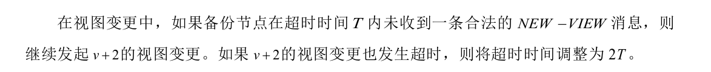

[1]鲁意. 区块链PBFT共识算法的可扩展性优化研究与实现[D].南京邮电大学,2022.DOI:10.27251/d.cnki.gnjdc.2022.000230.

1. 聚合签名是什么？  `Boneh-Lynn-Shacham (BLS)` 签名方案  -- > 在哪里发挥作用？

   1. ~~主要是在主节点将收集到的2*f+1条数字签名广播时，用处比较大，因为其他副本节点只需要对聚合签名验证一次即可，不需要对 2 * f+1条数字签名验证，减少了验证时间。~~
   2. 聚合签名将多个签名压缩，可以减少占用的存储空间（但是具体减少的多少需要实验）

2. 交易聚合技术？将多个交易合并为一个，一个交易聚合者（通常是矿工或交易池）从已广播的交易中选择要进行聚合的交易。选择的依据可能包括交易费用、交易大小或其他优先级标准。需要注意的是，交易聚合并不适用于所有类型的交易。**通常，只有相互独立且没有先后关系的交易才可以被聚合**。一些常见的应用包括批量转账、多个用户的合约互动等。

3. reply阶段：以下两种方式哪一种更好？

   1. 对于commit区块内的交易，每个副本节点都需要把交易执行，然后把执行结果发送给主节点，主节点同时收到 2*f条相同的执行结果，才能修改世界状态，并且要通知副本节点进行相同的修改。 （安全性更高？）
   2. 对于commit区块内的交易，直接由主节点完成所有交易的执行，完成本地世界状态的变化之后，把执行的交易按照顺序以区块形式打包发送给副本节点，让副本节点修改世界状态。（可用性更高？）

4. 仔细思考副本节点启动`view-change`的情况，目前只考虑了主节点宕机的情况，比如：长期未收到主节点的`pre-prepare`或者心跳包。没有考虑主节点是拜占庭节点的情况，在这种情况下，改论文考虑从以下节点入手（**考虑了主节点针对某一特定阶段进行恶意进攻的情况**）：

   

   但其实无论是主节点宕机引起的共识失效还是主节点是拜占庭节点引起的失效，都可以把**距离最近一次产生新区块的时间间隔是否超过了指定时长**作为一个统一的检测标准，因为这两种情况都会导致整个网络无法产生最新的区块。

5. 新的主节点拒绝接收**小于当前区块链最高块高度**的`view-change`消息，可以防止已经失效的节点对系统造成影响。
6. `view-change`消息中可以包含尚未完成共识的`pre-prepare`消息和`prepare`消息，这样可以在完成`view-change`后迅速回复对上一轮未完成共识的重启。（是否可以考虑把本地的`commit`消息也包含进入？）
7. 跟随节点在验证新主节点的`new-view`消息时也可以采用聚合签名验证的方法。
8. 动态调整`view-change`的启动间隔时间：

​	

9. `PBFT`改成O(N)通信复杂度：

   1. `pre-prepare`阶段通信复杂度就是O(N)不需要该；

   2. `prepare`阶段因为每个节点都需要广播，因此复杂度是O(N^2)，如果改成只发送给主节点就可以改成O(N);
   3.  `commit`阶段因为每个节点都需要广播，因此复杂度为O(N^2)，如果改成只由Leader节点将需要执行的交易（**其他节点可以验证交易是存在的且不重复的**）发送给其他节点可以变成O(N)；
   4. `reply`阶段原本需要每个节点都向客户端回复，因此的复杂度是O(N)，如果改成仅由`Leader`回复可以变成O(1)，但是这样安全性没有保障(`Leader`权利太大)，因此`reply`阶段最好还是由N个节点负责向客户端回复某笔交易的执行结果，从而防止`Leader`的虚假交易执行结果出现(交易可以根据`txID`锁定)。
   5. 这样一来，总的通信复杂度是 O(N) + O(N) + O(N) + O(N) = O(N)

10. 因为不是双层共识，这里就让每一个节点执行完交易后，自行组装区块存储到本地。如果网络节点都正常的话因为都是状态机，所有节点生成的区块应该就是一模一样的。

11. 针对某些节点可能出现区块落后的问题，可以为每一个节点安装区块同步模块。区块同步模块可以主动向其他节点发送同步请求，这里可以设置一个基于信誉的同步机制，避免从恶意节点处同步到区块。比如：只有当一个区块在全网的2*f+1个节点上存在时(简单起见，查看区块哈希即可)，才会将其同步过来。

12. **`view-change`的复杂度那一块没看懂**

13. 世界状态的存储：k-v结构 VS MPT树，表型结构是用空间换时间，这也是现今高流量应用的主流策略。

14. 性能测试：

    1. 通信复杂度的实验验证：在规定的时间内，看共识完成的轮次即可进行评估。
    2. 通信成本的验证：固定节点数目，计算完成一轮共识的KB大小（只包含一笔交易的情况下）
    3. 吞吐量分析：规定的节点数下，固定的区块大小和交易量下`TPS`的测量
    4. 延迟分析：固定区块大小，分析不同节点数量时的共识延迟；固定节点数量，不同区块大小时节点的共识延迟。